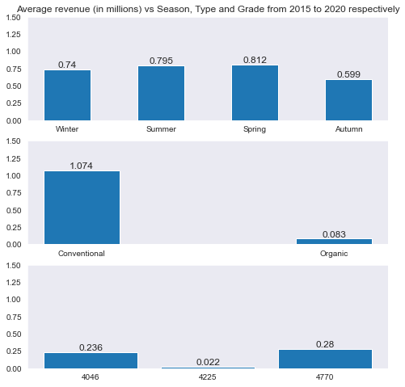
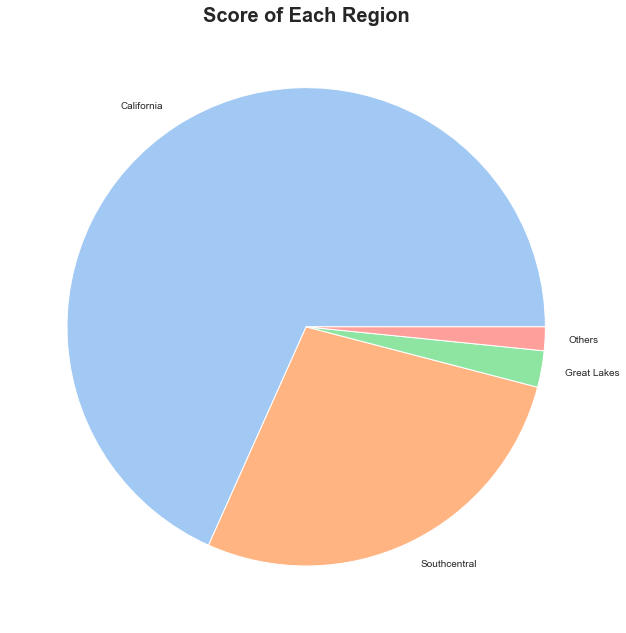
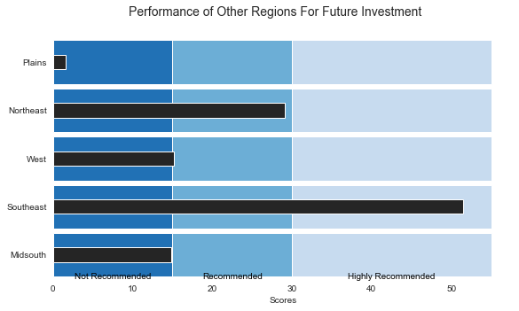

# Project Title
Avocado Industry Analysis

***

# Project Overview
In this project, we seek to advise a mock client, GreenGrocer in deciding if it is worthy to penetrate the Avocado industry. Thereafter, assist them in deciding which type of Avocado as well as which regions to set up shop in order to gain the maximum revenue.

***

# Installation and Setup
## Codes and Resources Used
Software Requirements and Editor used:
- **Editor Used:**  Visual Studio Code (VSCode)
- **Python Version:** 3.12.0

## Python Packages Used
- **Data Manipulation:** `pandas` and `numpy`
- **Data Visualization:** `matplotlib` and `seaborn`
- **Statistical Analysis:** `scipy` and `statsmodel`

***

# Data 
## Source Data
- **Kaggle:** The dataset used, 'avocado-updated-2020.csv' was acquired from Kaggle which consists of historical data from 4 January 2015 up to 17 May 2020, featuring avocado prices, sales volume, type of avocado in multiple cities, states and regions of US.
- **Statista:** The dataset of revenue from the fresh fruit industry between 2013 to 2026 (projected) was obtained from Statista, which contains the projected reveue of the fresh fruit industry for 150 countries

## Terminologies
| Category        | Description                                                                                                      |
|-----------------|------------------------------------------------------------------------------------------------------------------|
| Avocado Grades  | #4046, #4225, #4770                                                                                               |
| Avocado Type    | Conventional, Organic                                                                                            |
| Regions         | Plains, Southeast (SE), Southcentral (SC), Northeast (NE), West, Midsouth (MS), California (Cali), Great Lakes (GL) |
| Season          | Winter, Spring, Summer, Autumn                                                                                    |
| Average Price   | Average price of a single avocado in that week according to the respective locations                            |
| Total Volume    | Total number of avocados sold                                                                                     |

## Data Cleaning/Preprocessing
The data set originally contained 33,045 data listings. we first began checking for empty values, to minimize any subsequent issues due to possible errors in the data entry process. Thereafter, we removed any duplicate data present which will cause the analysis to be skewed. After cleaning the data to increase accuracy, a total of 11,273 listings was used for further analysis.

***

# Results and Evaluation
## Scoring system
To assist GreenGrocer in finding out the best region to enter, we dervied a scoring system to evaluate each of the regions in the US based on 3 variables: seasons, type and grade.

With reference to the figure above, for seasons, since Spring has the highest average revenue, it will be allocated with 4 points, followed by Summer (3 points), Winter (2 points), and Autumn (1 point). And for type, conventional avocados will be assigned with 2 points and organic with 1 point, and for the grade of avocados, “4770” will be given 3 points, “4046” with 2 points, and “4225” with 1 point

## Scores for Each Region

By using a pie chart to compare the relative performance of each region against one another, we can observe that California has the highest score, followed by Southcentral and Great Lake. The 5 other regions that GreenGrocer can potentially venture into are classified under 'Others', due to its low proportion of scores. With these outstanding score, GreenGrocer should penetrate into California, Southcentral and Great Lakes.

To analyse the 5 other regions on a deeper level, the standards 'Not Recommended', 'Recommended' and 'Highly Recommended' have been determined through the past experience with dealing with other fruit companies who have sought help from regarding the same issue. We can see that should GreenGrocer acquire more capital and be willing to set up more avocado shops in more regions other than the 3 identified above, they should target the Southeast and Norteast regions.

## Limitations & Improvements
- **Limited Avocado Types:** The dataset only explores Hass avocados, providing a limited view of the avocado industry as there are many other varieties availiable. Although we are not able to determine the most lucrative revenue-generating variety, our analysis is useful for the business problem since Hass avocados are the most popular worldwide.

- **Factors of Demand:** The historical data solely represents the number of avocados sold in each region and does not take into account avocado demand. Demand and amount supplied are not equal since there may be instances when there is insufficient avocado supply to match the stipulated demand. The potential revenue generated, particularly in locations where demand exceeds quantity sold, may be significant. However, due to supply limits, the region can only deliver the restricted number of avocados available. As a result, when there is excess demand but insufficient supply, the money generated may be overstated, and the dataset may not accurately reflect the revenue that may be earned in the location.

- **Inability to Capture Certain Regions:** The dataset used might not capture all regions in the US since there are 50 states in the US but not all may be reflected equally in the dataset. Therefore, there is a possibility of missing out on a state that can generate higher profits than the one we concluded on, resulting in possibly an inaccurate and incorrect market-entry strategy for GreenGrocer

- **Different Number of Avocado Sellers in Each State:** The total number of avocados provided in the dataset is aggregated sum of the avocados sold by all existing sellers in each region. Thus, it may not reflect the number of sellers and show the overall trend of each vendor. Using the total number of avocados sold by all sellers, we are unable to determine whether there are different trends for each seller. As a result, we are unable to estimate the actual volume sold at each location. However, because a general trend is apparent, we believe the analysis is solid enough for GreenGrocer.

