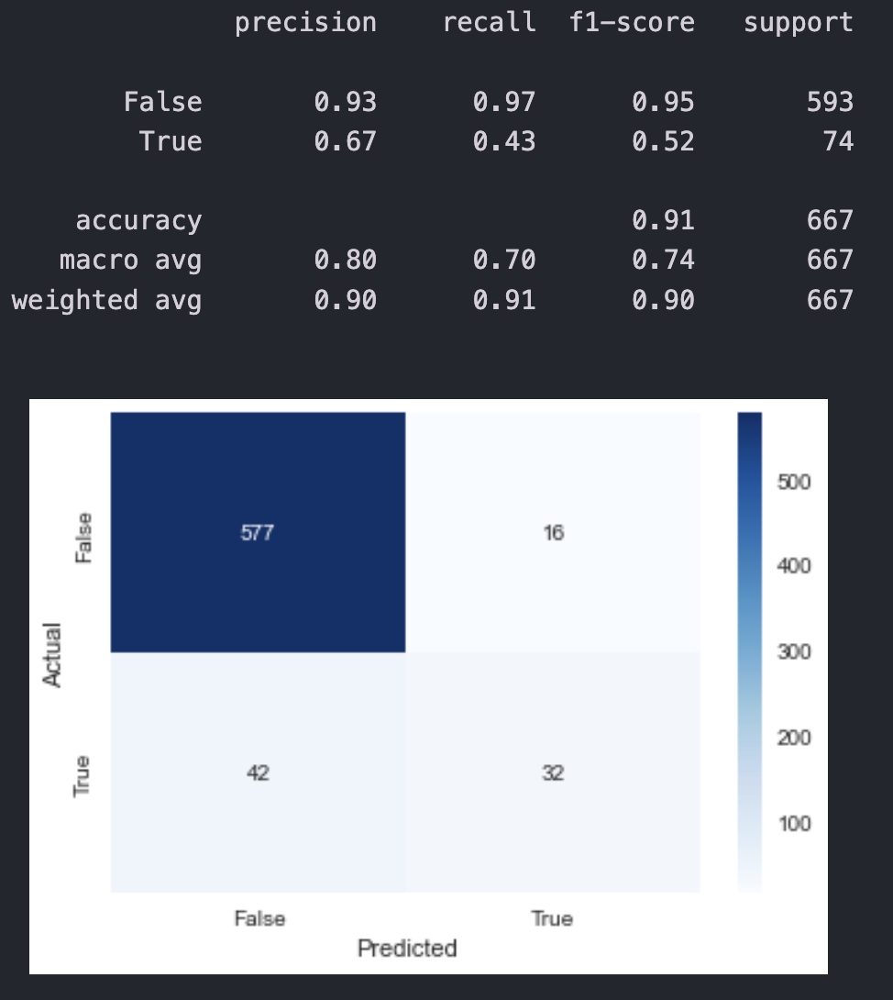
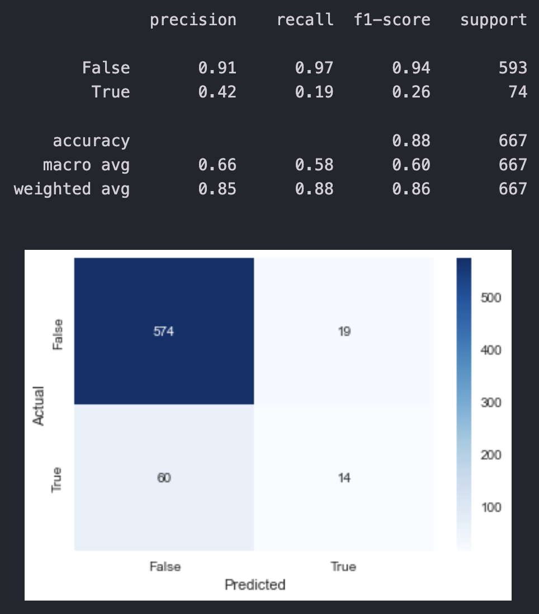
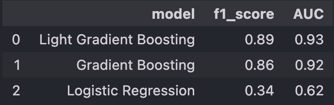

# Project Title
Customer Churn Prediction

***

# Project Overview
Predicting customer churn is an essential task for any business, especially subscription-based businesses. This project aims to build models to predict whether a customer would churn based on their features. The models would then be trained, evaluated and tested to find the best model for this dataset. Models used are: **Logistic Regression**, **Light Gradient Boosting Machine** and **Gradient Boosting** classifiers.

***

# Installation and Setup
## Codes and Resources Used
Software Requirements and Editor used:
- **Editor Used:**  Visual Studio Code (VSCode)
- **Python Version:** 3.12.0

## Python Packages Used
- **Data Manipulation:** `pandas` and `numpy`
- **Data Visualization:** `matplotlib` and `seaborn`
- **Machine Learning:** `scikit-learn`

***

# Data 
## Source Data
- **Kaggle:** The dataset was obtained from [Telcom Data](https://www.kaggle.com/datasets/spscientist/telecom-data) 

## Description of Dataset
| Column Name          | Column Type  | Column Description                                          |
| -------------------- | ------------ | ------------------------------------------------------------ |
| State                | String       | The state where a customer comes from                        |
| Account length       | Integer      | Number of days a customer has been using services            |
| Area code            | Integer      | The area where a customer comes from                         |
| Phone number         | Alphanumeric | The phone number of a customer                               |
| International plan   | String       | The status of customer international plan                    |
| Voicemail plan       | String       | The status of customer voicemail plan                        |
| No. vmail msgs       | Integer      | Number of voicemail messages sent by a customer              |
| Total day minutes    | Float        | Total call minutes spent by a customer during the day time    |
| Total day calls      | Integer      | Total number of calls made by a customer during the day time |
| Total day charge     | Float        | Total amount charged to a customer during the day time       |
| Total eve minutes    | Float        | Total call minutes spent by a customer during the evening time |
| Total eve calls      | Integer      | Total number of calls made by a customer during the evening time |
| Total eve charge     | Float        | Total amount charged to a customer during the evening time   |
| Total night minutes  | Float        | Total call minutes spent by a customer during the night time |
| Total night calls    | Integer      | Total number of calls made by a customer during the night time |
| Total night charge   | Float        | Total amount charged to a customer during the night time     |
| Total intl minutes   | Float        | Total international call minutes spent by a customer         |
| Total intl calls     | Integer      | Total number of international calls made by a customer       |
| Total int charge     | Float        | Total international call amount charged to a customer        |
| Customer service calls | Integer    | Total number of customer service calls made by a customer    |
| Churn                | Boolean      | Whether a customer is churned or not                         |

## Data Cleaning/Preprocessing
- The dataset contained 3333 non-value records thus there was not much data cleaning required. 
- For data preprocessing, `area_code` was converted from a string `numerical` to `object` type since they represented specific areas.
- The dataset was then split into training and test for the model building process.
- Categorical variables were also one-hot encoded, with one of the levels in each categorical variable dropped to avoid multicollinearity issue.

***

# Results and Evaluation
## Model Evaluation
### Gradient Boosting Classifier
Confusion Matrix and Classification Report:

- From the confusion matrix, we can see that the f1-score for negative case (people who do not churn) is much higher than that of positive case (people who churn). This is mainly due to the dataset having 86% of the records comprising people who did not churn.
- Overall accuracy is rather high, with a value of 91%.

### Light Gradient Boosting Machine (LGBM) Classifier
Confusion Matrix and Classification Report:

- From the confusion matrix, the f1-score for the negative case for the LGBM Classifier is also significantly higher than that of the positive case
- Overall accuracy is very high, with a value of 91%

### Logistic Regression
Confusion Matrix and Classification Report:

- From the confusion matrix, the f1-score for the negative case is still significantly higher than that of the positive case but slightly lower than LGBM and Gradient Boosting Classifiers.
- Overall accuracy is still high but lower than that of the previous 2 models.

## Model Comparison

- From the model evaluation, we can see that the Light Gradient Boosting has the highest f1_score and AUC among the 3 models. Thus, it should be the model to be used to predict if the customer churns or not. 
- We can also see that in all 3 models, they do extremely well in predicting if a customer does not churn as all 3 models have the higher f1_score when predicting the False case.
