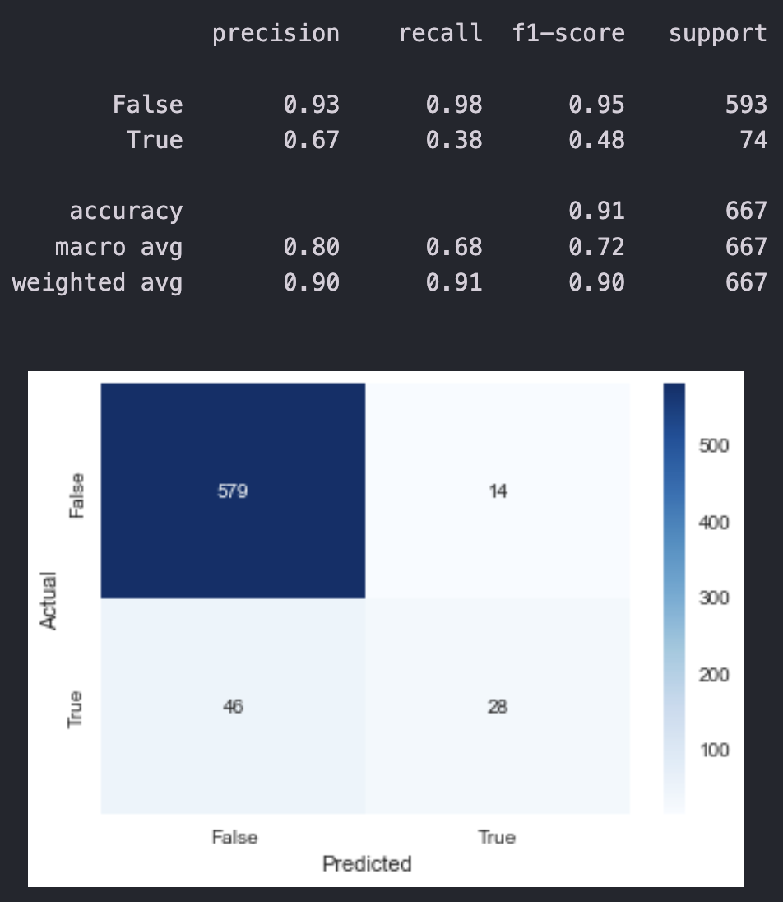

# Project Title
Customer Churn Prediction

***

# Project Overview
Predicting customer churn is an essential task for any business, especially subscription-based businesses. This project aims to build models to predict whether a customer would churn based on their features. The models would then be trained, evaluated and tested to find the best model for this dataset. Models used are: **Logistic Regression**, **Light Gradient Boosting Machine** and **Gradient Boosting** classifiers.

***

# Installation and Setup
## Codes and Resources Used
Software Requirements and Editor used:
- **Editor Used:**  Visual Studio Code (VSCode)
- **Python Version:** 3.12.0

## Python Packages Used
- **Data Manipulation:** `pandas` and `numpy`
- **Data Visualization:** `matplotlib` and `seaborn`
- **Machine Learning:** `scikit-learn`

***

# Data 
## Source Data
- **Kaggle:** The dataset was obtained from [Telcom Data](https://www.kaggle.com/datasets/spscientist/telecom-data) 

## Description of Dataset
| Column Name          | Column Type  | Column Description                                          |
| -------------------- | ------------ | ------------------------------------------------------------ |
| State                | String       | The state where a customer comes from                        |
| Account length       | Integer      | Number of days a customer has been using services            |
| Area code            | Integer      | The area where a customer comes from                         |
| Phone number         | Alphanumeric | The phone number of a customer                               |
| International plan   | String       | The status of customer international plan                    |
| Voicemail plan       | String       | The status of customer voicemail plan                        |
| No. vmail msgs       | Integer      | Number of voicemail messages sent by a customer              |
| Total day minutes    | Float        | Total call minutes spent by a customer during the day time    |
| Total day calls      | Integer      | Total number of calls made by a customer during the day time |
| Total day charge     | Float        | Total amount charged to a customer during the day time       |
| Total eve minutes    | Float        | Total call minutes spent by a customer during the evening time |
| Total eve calls      | Integer      | Total number of calls made by a customer during the evening time |
| Total eve charge     | Float        | Total amount charged to a customer during the evening time   |
| Total night minutes  | Float        | Total call minutes spent by a customer during the night time |
| Total night calls    | Integer      | Total number of calls made by a customer during the night time |
| Total night charge   | Float        | Total amount charged to a customer during the night time     |
| Total intl minutes   | Float        | Total international call minutes spent by a customer         |
| Total intl calls     | Integer      | Total number of international calls made by a customer       |
| Total int charge     | Float        | Total international call amount charged to a customer        |
| Customer service calls | Integer    | Total number of customer service calls made by a customer    |
| Churn                | Boolean      | Whether a customer is churned or not                         |

## Data Cleaning/Preprocessing
- The dataset contained 3333 non-value records thus there was not much data cleaning required. 
- For data preprocessing, `area_code` was converted from a string `numerical` to `object` type since they represented specific areas.
- The dataset was then split into training and test for the model building process.
- Categorical variables were also one-hot encoded, with one of the levels in each categorical variable dropped to avoid multicollinearity issue.

***

# Results and Evaluation
## Model Evaluation
### Logistic Regression
Confusion Matrix and Classification Report:

## Scores for Each Region

By using a pie chart to compare the relative performance of each region against one another, we can observe that California has the highest score, followed by Southcentral and Great Lake. The 5 other regions that GreenGrocer can potentially venture into are classified under 'Others', due to its low proportion of scores. With these outstanding score, GreenGrocer should penetrate into California, Southcentral and Great Lakes.

To analyse the 5 other regions on a deeper level, the standards 'Not Recommended', 'Recommended' and 'Highly Recommended' have been determined through the past experience with dealing with other fruit companies who have sought help from regarding the same issue. We can see that should GreenGrocer acquire more capital and be willing to set up more avocado shops in more regions other than the 3 identified above, they should target the Southeast and Norteast regions.

## Limitations & Improvements
- **Limited Avocado Types:** The dataset only explores Hass avocados, providing a limited view of the avocado industry as there are many other varieties availiable. Although we are not able to determine the most lucrative revenue-generating variety, our analysis is useful for the business problem since Hass avocados are the most popular worldwide.

- **Factors of Demand:** The historical data solely represents the number of avocados sold in each region and does not take into account avocado demand. Demand and amount supplied are not equal since there may be instances when there is insufficient avocado supply to match the stipulated demand. The potential revenue generated, particularly in locations where demand exceeds quantity sold, may be significant. However, due to supply limits, the region can only deliver the restricted number of avocados available. As a result, when there is excess demand but insufficient supply, the money generated may be overstated, and the dataset may not accurately reflect the revenue that may be earned in the location.

- **Inability to Capture Certain Regions:** The dataset used might not capture all regions in the US since there are 50 states in the US but not all may be reflected equally in the dataset. Therefore, there is a possibility of missing out on a state that can generate higher profits than the one we concluded on, resulting in possibly an inaccurate and incorrect market-entry strategy for GreenGrocer

- **Different Number of Avocado Sellers in Each State:** The total number of avocados provided in the dataset is aggregated sum of the avocados sold by all existing sellers in each region. Thus, it may not reflect the number of sellers and show the overall trend of each vendor. Using the total number of avocados sold by all sellers, we are unable to determine whether there are different trends for each seller. As a result, we are unable to estimate the actual volume sold at each location. However, because a general trend is apparent, we believe the analysis is solid enough for GreenGrocer.

