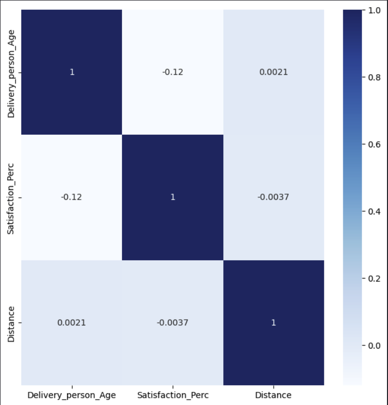
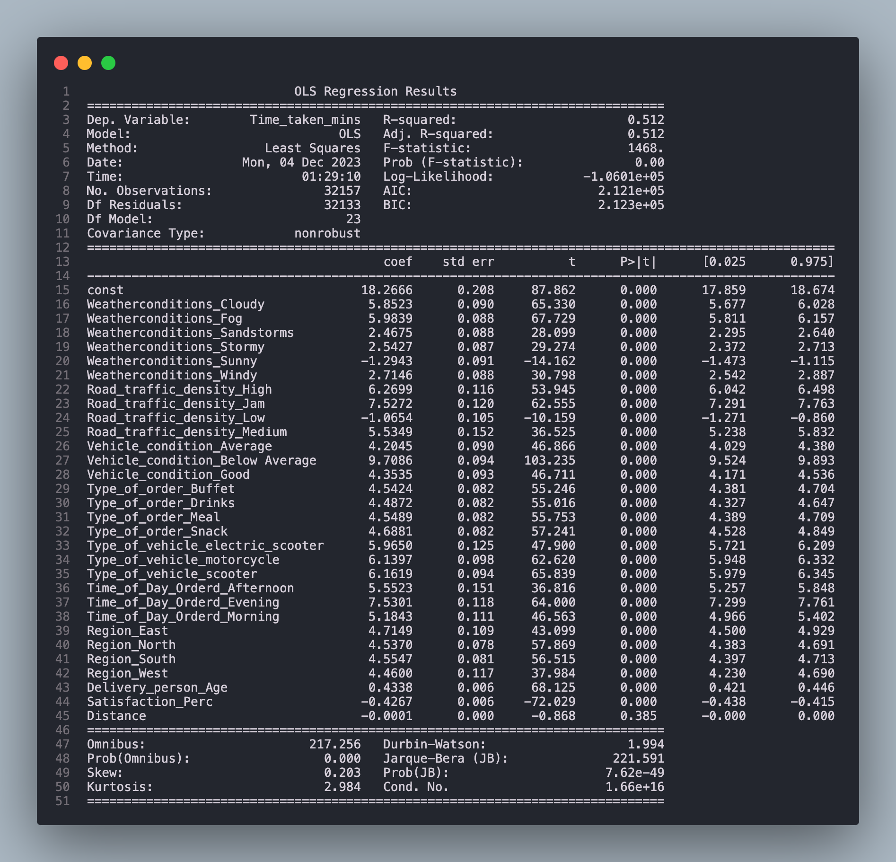
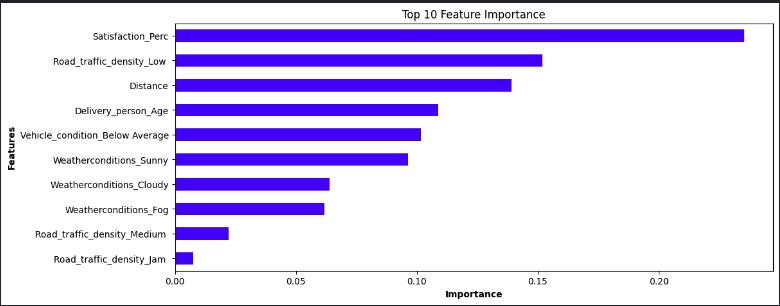
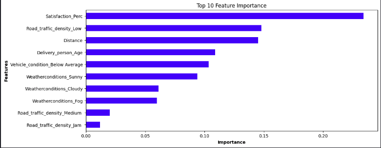
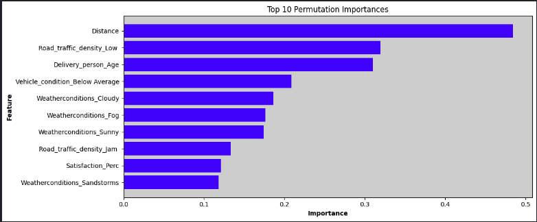

# Project Title
Delivery Duration Prediction

***

# Project Overview
This project aims to find out and investigate the relevant factors that can affect food delivery duration. Since this is a regression tasks, regression models such as **Multiple Linear Regression**, **Random Forest Regression**, **Gradient Boosting Regression** and **Neural Network Regression** will be used.

By first carrying out some data cleaning and preprocessing before building the models, we will see which of the aforementioned models are the best to describe this dataset. We would also see which are the features that are the most important/relevant in explaining the delivery duration.

***

# Installation and Setup
## Codes and Resources Used
Software Requirements and Editor used:
- **Editor Used:**  Visual Studio Code (VSCode)
- **Python Version:** 3.12.0

## Python Packages Used
- **General Packages:** `itertools`, `re`, `math`
- **Data Manipulation:** `pandas` and `numpy`
- **Data Visualization:** `matplotlib` and `seaborn`
- **Statistical Analysis:** `scipy` and `statsmodels`
- **Machine Learning:** `scikit-learn`

***

# Data 
## Source Data
- **Kaggle:** The dataset was obtained from [Food Delivery Data](https://www.kaggle.com/datasets/gauravmalik26/food-delivery-dataset)

## Description of Dataset
| Column Name               | Column Type  |
|---------------------------|--------------|
| Delivery_person_ID        | String       |
| Delivery_person_Age       | Float        |
| Delivery_person_Ratings   | Float        |
| Restaurant_latitude       | Float        |
| Restaurant_longitude      | Float        |
| Delivery_location_latitude| Float        |
| Delivery_location_longitude| Float       |
| Order_Date                | Datetime     |
| Time_Ordered              | String       |
| Time_Order_picked         | String       |
| Weather_conditions        | String       |
| Road_traffic_density      | String       |
| Vehicle_condition         | String       |
| Type_of_order             | String       |
| Type_of_vehicle           | String       |
| Multiple_deliveries       | String       |
| Festival                  | String       |
| City                      | String       |
| Time_taken(min)           | Float        |

## Data Cleaning/Preprocessing
- The dataset contained 45593 records with a total of 8515 null records. After dropping the nulls, there are 37078 remaining records.

### Delivery Person Age
- `Delivery_person_Age` was converted from a `object` to `float` type

### Delivery Person Ratings
- `Delivery_person_Ratings` was also converted from a `object` to `float` type

### Order Date and Time_Order_picked
- `Order_Date` and `Time_Orderd` was converted to `datetime` object 
- The hour from `Order_Date` and `Time_Orderd` columns were extracted so that they could be classified into `Morning`, `Afternoon`, `Evening`

### Getting distance between Restaurant and Delivery location using Latitude and Longitude Data
- Using the haversine formula, we can find the distance between 2 locations using their Latitude and Longitude data
- By using the formula, the distance between the restaurant and delivery location was obtained

### Getting the region where the Restaurant and Delivery location are in
Since this was not given explicitly in the dataset, I opted to use KMeans Clustering to determine the region

The logic for obtaining the region is as follows:
- Since this data is obtained from India, I have approximated the coordinates for the center of the North, South, East and West regions based on Google Maps
- Setting the number of clusters as 4, we are able to obtain the clusters using the KMeans clustering algorithm

### Weather Conditions
- In the original data, the `Weatherconditions` columns was written with weather infront of the weather condition
- Only the weather condition was extracted for use

### Time Taken
- In the original data, the string `mins` was included alongside the numerical time taken
- Only the numerical time taken was extracted for use

### Vehicle Condition
- In the original data, the columns contained values 0 - 2 and there was not explaination of column
- As such, I created my own condition with 0 being `Below Average`, 1 being `Average` and 2 being `Good`

### Deliver person rating
- Instead of leaving the ratings from limited from 0-5, I decided to change the ratings into a satisfaction percentage using the following transformation: `ratings/5 * 100`

### Final Dataset
- At the end of all the data cleaning and preprocessing, there were 40197 rows with following 11 columns:

| Column Name           | Column Type  |
|-----------------------|--------------|
| Delivery_person_Age   | Feature      |
| Satisfaction_Perc     | Feature      |
| Weatherconditions     | Feature      |
| Road_traffic_density  | Feature      |
| Vehicle_condition     | Feature      |
| Type_of_order         | Feature      |
| Type_of_vehicle       | Feature      |
| Time_of_Day_Ordered   | Feature      |
| Distance              | Feature      |
| Region                | Feature      |
| Time_taken_mins       | Target       |

## Data Exploration
### Correlation Matrix between Numerical Variables
- All numerical data was scaled using StandardScaler for easier comparison

From the correlation matrix, we can see that there is almost no correlation between the numerical variables which is a good sign since having high correlation may lead to multicollinearity issues.

### Correlation/association between categorical variables
To test for the correlation between categorical variables, we will use the [Chi-Squared Test of Independence](https://www.jmp.com/en_sg/statistics-knowledge-portal/chi-square-test/chi-square-test-of-independence.html) and the [Cramér's V](https://www.ibm.com/docs/en/cognos-analytics/11.1.0?topic=terms-cramrs-v)

**Chi-Squared Test of Independence**
With a p-value of 0.05, the pairs that are dependent are: `Road_traffic_density` and `Time_of_Day_Orderd`, `Vehicle_condition` and `Type_of_vehicle`, `Type_of_vehicle` and `Region`

**Cramér's V**
| Variable 1           | Variable 2         | Cramér's V     |
| -------------------- | ------------------ | -------------- |
| Road_traffic_density | Time_of_Day_Orderd | 0.774          |
| Vehicle_condition    | Type_of_Vehicle    | 0.480          |
| Type_of_vehicle      | Region             | 0.0105         |

From the variables that are dependent, we can see that:
- There is very strong correlation between Road Traffic Density and Time of Day Ordered which is understandable since ordering at peak hour timings would mean high road traffic density
- There is moderate correlation between vehicle condition and type of vehicle 
- There is weak correlation between type of vehicle and region

***

# Results and Evaluation
## Model Evaluation
### Multiple Linear Regression
Regression Output Results:

- From the confusion matrix, we can see that the f1-score for negative case (people who do not churn) is much higher than that of positive case (people who churn). This is mainly due to the dataset having 86% of the records comprising people who did not churn.
- Overall accuracy is rather high, with a value of 91%.

### Light Gradient Boosting Machine (LGBM) Classifier
Confusion Matrix and Classification Report:

- From the confusion matrix, the f1-score for the negative case for the LGBM Classifier is also significantly higher than that of the positive case
- Overall accuracy is very high, with a value of 91%

### Logistic Regression
Confusion Matrix and Classification Report:

- From the confusion matrix, the f1-score for the negative case is still significantly higher than that of the positive case but slightly lower than LGBM and Gradient Boosting Classifiers.
- Overall accuracy is still high but lower than that of the previous 2 models.

## Model Comparison

- From the model evaluation, we can see that the Light Gradient Boosting has the highest f1_score and AUC among the 3 models. Thus, it should be the model to be used to predict if the customer churns or not. 
- We can also see that in all 3 models, they do extremely well in predicting if a customer does not churn as all 3 models have the higher f1_score when predicting the False case.

