# Project Title
Hotel Cancellation Rate Analysis

***

# Project Overview
The project aims to tackle the challenge of high cancellation rates in the hospitality industry, specifically targeting Hotel Group 88 (HG88). With cancellation rates peaking at **37%** across two properties, HG88 has partnered with SAGA Consulting Group (SAGA) to enhance operational efficiency and reduce cancellations.

SAGA will utilize data analytics along with Large Language Models (LLMs), to delve into cancellation complexities, segment consumers, develop prediction models, identify high-risk customers, and determine primary drivers behind cancellations. This process will culminate in actionable recommendations for HG88 to implement personalized marketing campaigns and refine business practices to mitigate high cancellation rates effectively.

***

# Installation and Setup
## Codes and Resources Used
Software Requirements and Editor used:
- **Editor Used:**  Visual Studio Code (VSCode)
- **Python Version:** 3.12.0

## Python Packages Used
- **General Packages:** `warnings`
- **Data Manipulation:** `pandas` and `numpy`
- **Data Visualization:** `matplotlib` and `seaborn`
- **Statistical Analysis:** `scipy`
- **Machine Learning:** `scikit-learn`, `tensorflow`, `keras`, `xgboost`, `kmodes`
- **Multi-Processing:** `multiprocessing`, `joblib`

***

# Data 
## Source Data
- **Kaggle:** The dataset was obtained from [Hotel Booking Demand Data](https://www.kaggle.com/datasets/jessemostipak/hotel-booking-demand)

## Description of Dataset
| Column                          | Description                                              | Data Type         |
|---------------------------------|----------------------------------------------------------|-------------------|
| hotel                           | Indicates whether the booking is for a city hotel or resort hotel | Categorical       |
| is_canceled                     | Indicates if the booking is canceled (1) or not (0)     | Binary            |
| lead_time                       | Number of days between booking date and the arrival date | Integer           |
| arrival_date_year               | Year of arrival date                                    | Integer           |
| arrival_date_month              | Month of arrival date                                   | Categorical       |
| arrival_date_week_number        | Week number of arrival date                             | Integer           |
| arrival_date_day_of_month       | Day of the month of the arrival date                    | Integer           |
| stays_in_weekend_nights         | Number of weekend nights (Saturday or Sunday) the guest stayed or booked to stay | Integer |
| stays_in_week_ends              | Number of week nights (Monday to Friday) the guest stayed or booked to stay | Integer |
| adults                          | Number of adults                                        | Integer           |
| children                        | Number of children                                      | Integer           |
| babies                          | Number of babies                                        | Integer           |
| meal                            | Type of meal booked                                     | Categorical       |
| country                         | Country of origin                                       | Categorical       |
| market_segment                  | Market segment designation                             | Categorical       |
| distribution_channel            | Booking distribution channel                            | Categorical       |
| is_repeated_guest               | Indicates if the booking customer is a repeated guest (1) or not (0) | Categorical |
| previous_cancellations          | Number of previous bookings that were canceled by the customer | Integer     |
| previous_bookings_not_canceled  | Number of previous non-canceled bookings by the customer | Integer     |
| reserved_room_type              | Code of the reserved room type                          | Categorical       |
| assigned_room_type              | Code of the assigned room type                          | Categorical       |
| booking_changes                 | Number of changes/amendments made to the booking        | Integer           |
| deposit_type                    | Indication of the type of deposit                       | Categorical       |
| days_in_waiting                 | Number of days the booking was in the waiting list      | Integer           |
| customer_type                   | Type of customer                                        | Categorical       |
| adr                             | Average Daily Rate for the booking                      | Integer           |
| required_car_parking_spaces     | Number of car parking spaces required by the customer   | Integer           |
| total_special_requests          | Number of special requests made by the customer         | Integer           |

## Data Cleaning/Preprocessing

### Agents and Company
- The dataset lacks comprehensive information regarding agents and the company, limiting its utility. Moreover, the presence of numerous missing values in these columns (16340 and 112593 nulls respectively) may compromise the accuracy of our analysis. Thus, `agents` and `companny` columns were removed

### Reservation Status Date and Reservation Status
- `reservation_status_date` was removed as its information is available in other columns
- `reservation_status` directly gives us if the booking was cancelled so it was also removed

### Dropping NULLS
- The remaining nulls came from `children` and `country` columns, amount to 492 rows (0.4% of total rows)
- Decision was made to drop the nulls as it should not affect our analysis

### Scaling and Splitting of Data
- MinMaxScaler was used instead of StandardScaler as our data contains non-negative variables (eg. lead time, daily rate)
- The main dataset was split into training and test data using an 80/20 ratio, which was subsequently employed to train and assess the models

### Customer Segmentation using Clustering
- Since our dataset contains both categorical and numerical data, we opted to use KModes clustering to better understand the hotel industry by identifying customer segments
- Our goal for clustering is to further breakdown the data and find potential insights within clusters or engineer new features which may help with model prediction

Elbow Plot:

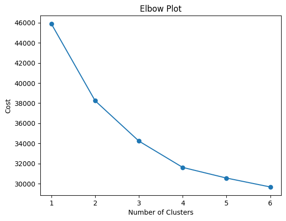

Centroids of Clusters and Assigned Cluster Names by Various LLMs

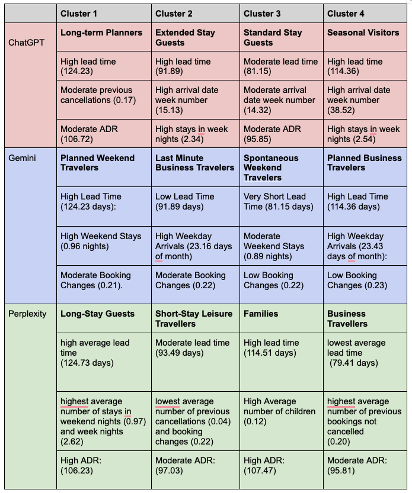

- Final decision was to use the responses generated by Perplexity as it provided the best justifications for segmenting the customers into 4 groups which made business sense and is consistent with our interpretation of the data
- Using this information, we aim to enable HG88 to understand their client base better and adopt specialised marketing tools for each group

### Final Dataset
- After data cleaning and preprocessing, there are a total of 28 columns (17 numerical and 7 categoricals), with 118,898 rows of data.

## Data Exploration
### Correlation Matrix between Numerical Variables

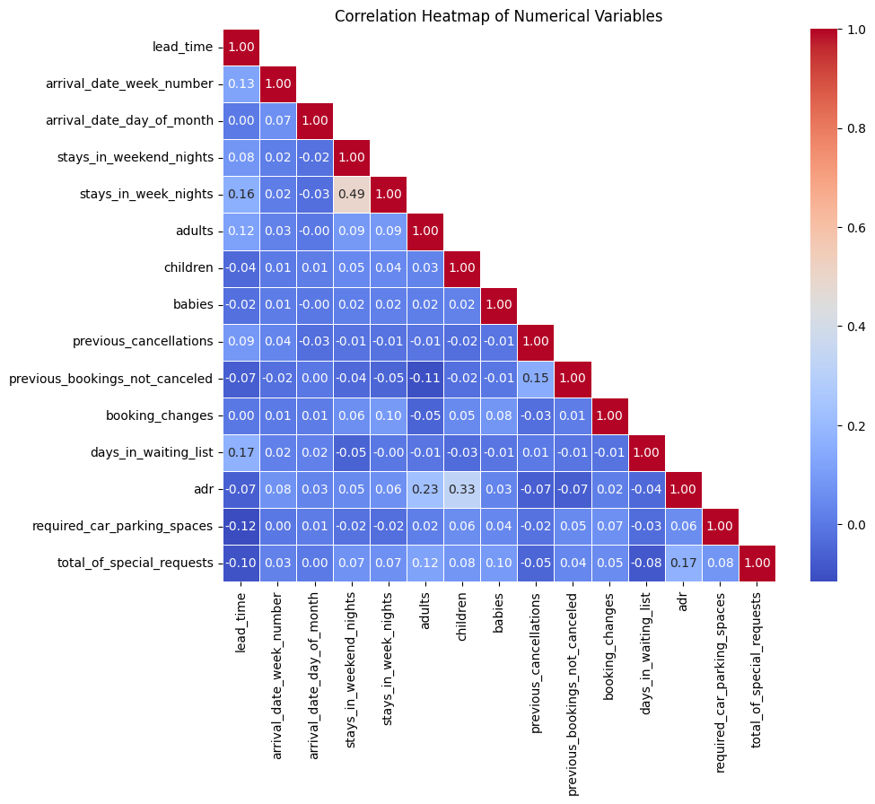

- The correlation heatmap indicates no signficant correlation among the variables, ensuring model stability and robustness
- Highest correlation is between `stays_in_week_nights` and `stays_in_weekend_nights` with a value of 0.49
- To further explore the reasons behind these findings, we consulted both ChatGPT and Gemini where packages deals, promotions and travel patterns were cited as potential reasons. These findings align with our intuitive understanding of the underlying dynamics

### Correlation/association between categorical variables
To test for the correlation between categorical variables, we will use the [Chi-Squared Test of Independence](https://www.jmp.com/en_sg/statistics-knowledge-portal/chi-square-test/chi-square-test-of-independence.html) and the [Cramér's V](https://www.ibm.com/docs/en/cognos-analytics/11.1.0?topic=terms-cramrs-v)

**Highly Correlated Pairs**
| Variable 1             | Variable 2             | Cramer's V |
|------------------------|------------------------|------------|
| reserved_room_type     | assigned_room_type     | 0.778      |
| market_segment         | distribution_channel   | 0.614      |
| deposit_type           | is_canceled            | 0.481      |
| arrival_date_year      | arrival_date_month     | 0.428      |
| hotel                  | assigned_room_type     | 0.391      |
| market_segment         | deposit_type           | 0.374      |
| country                | is_canceled            | 0.358      |
| market_segment         | is_repeated_guest      | 0.353      |
| hotel                  | reserved_room_type     | 0.325      |
| hotel                  | meal                   | 0.318      |
| country                | deposit_type           | 0.312      |
| distribution_channel   | is_repeated_guest      | 0.302      |
| hotel                  | country                | 0.301      |

From the variables that are dependent, we can see that:
- The highest association is between `reserved_room_type` and `assigned_room_type` with a value of 0.778. This finding is intuitive since customer typically receive the rooms they reserved during booking, barring unforeseen circumstances.

### Consumer Booking Patterns Over the Years
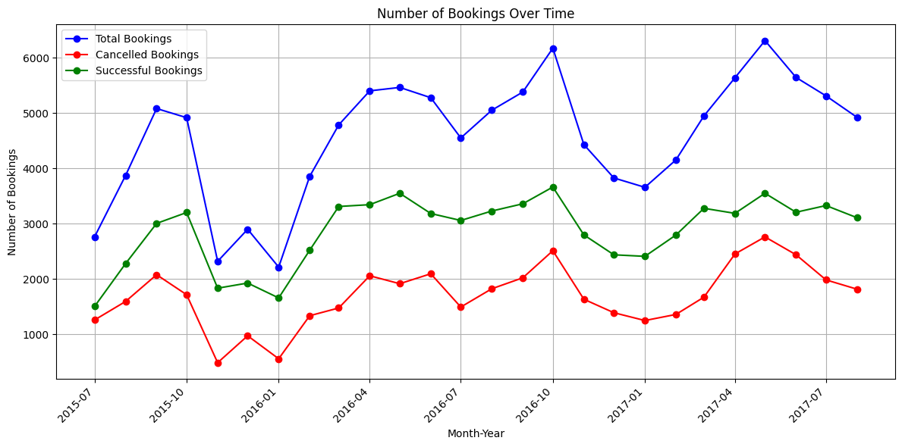

- HG88 experienced increased customer engagement and a consistent growth in total bookings over the year. However, this growth also led to a rise in cancellations, as noted by Chua (2020).
- Despite the growth rate of total bookings surpassing cancellations, the issue of cancellations remains significant. It is essential to address this concern, even though cancellation rates have declined over time.

### Month-on-Month Change in Cancellation Rates
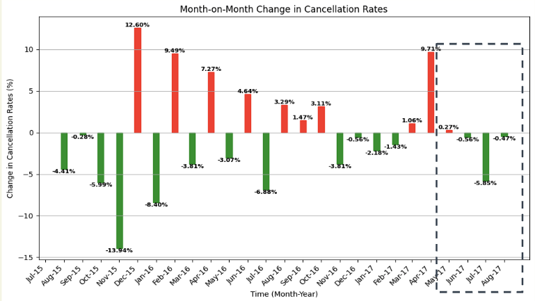

- There is consistent decline in Month-on-Month cancellation rates over the years
- Cancellation ratees seem to be more stable in recent months, indicating positive progress
- This reduced volatility enhances the planning and resource allocation accuracy

### Analysis of Cancellation Rates Across HG88's Hotel Types
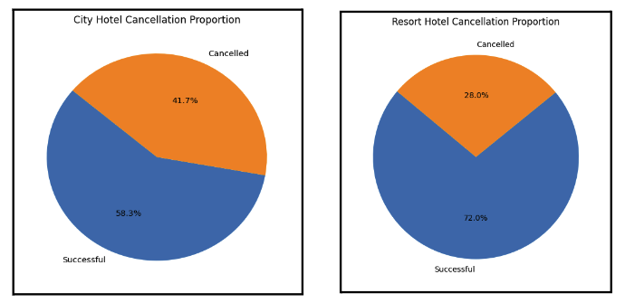

- The charts showed that City Hotel contributed significantly to the cancellation rates
- Leveraging on LLMs, our findings revealed that:
    - Leisure travellers tend to book Resort Hotels with firm plans
    - City Hotel attract last-minute planners, leading to more cancellations due to shorter booking lead times

### Identifying Factors Driving Cancellation Rates
To streamline the analysis, 3 key factors merged as primary hypotheses, providing a foundation for strategy formulaiton.

**Booking Lead Time Hypothesis**
- This hypothesis seeks to prove if the time gap between booking and arrival significantly impacts cancellation rates

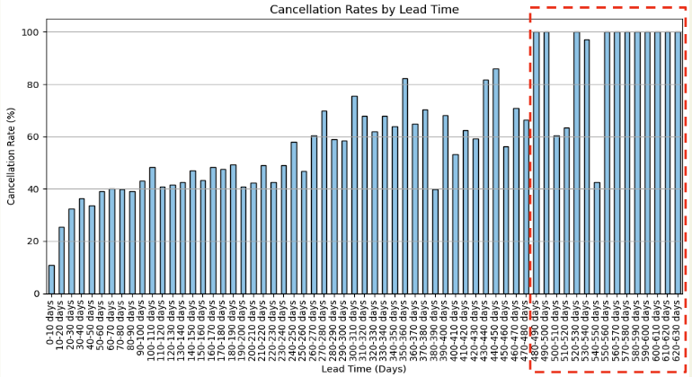

The figure above seems to validate the hypothesis, clearly depicting that cancellations rates rise as booking lead time increases. Moreover, most bookings made over 480 days in advanced were cancelled. Using this chart, it appears that these bookings are vulnerable to cancellations and HG88 should prioritise minimising cancellation rates among reservations with high lead times since there is more room for improvement. However, while it is important to consider cancellation rates, the business impact should also be looked at.

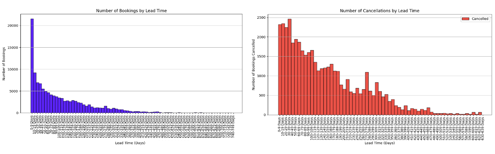

However, from the image above, we see that the number of bookings and cancellations are clustered around shorter booking lead times. There is only a small number of number booking that were made more than 480 days in advanced. Thus, focusing on reservations with long booking lead times is misguided, and it will be more beneficial for the hotel group toreduce cancellation rates for bookings with shorter lead times since it will cover more reservations.

**Deposit Type Hypothesis**
- This hypothesis claims that the type of deposit made by the customer will significantly impact the cancellation of bookings.

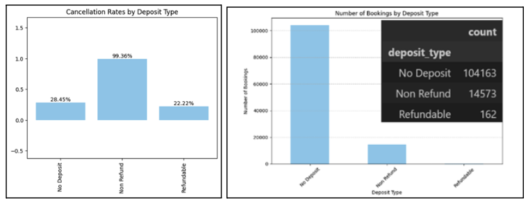

Surprisingly, our data indicate that people with non-refundable booking tend to cancel more, sitting at 99.36%. Upon closer inspection, it is observed that only 0.1% of total bookings were refundable, which implies that this phenomenon could be an outlier situation. Hence, more data is required before the hypothesis can be accepted or rejected conclusively.

**Seasonal Trend Hypothesis**
- The final hypothesis is that different seasonal travelling period can affect cancellation rates differently. For example, peak tourist seasons draw in more holiday-goers but also invites fierce competition from rival chains, possibly leading to higher cancellation rates.

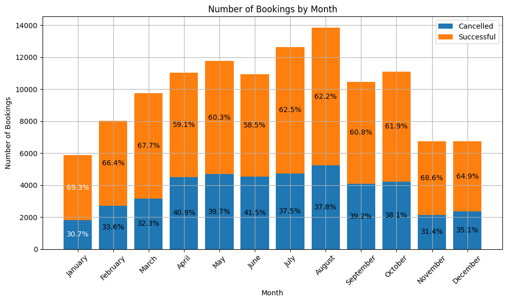

The figure above demostrates that cancellation rates can be cyclical - peaking between April and June, a popular travelling period. Hence, countermeasures such as dynamic pricing or issuing promo codes could help encourge to stay with their bookings.
***

# Models
Our dataset reveals an inherent imbalance, with 37% of bookings marked as canceled. To address this, we turned to ensemble learning methods like Random Forest and XGBoost alongside a Neural Network approach. These techniques are known for their effectiveness in managing imbalanced data distributions.

## Neural Network
We leveraged on the prowess of LLMs to obtain the code for the Neural Network
model. The final model that was created generated very positive results, achieving the highest AUC score of all models at 0.845, while the meals under the “BB” category (Breakfast & Bed) were found to be the most significant driver of cancellation.

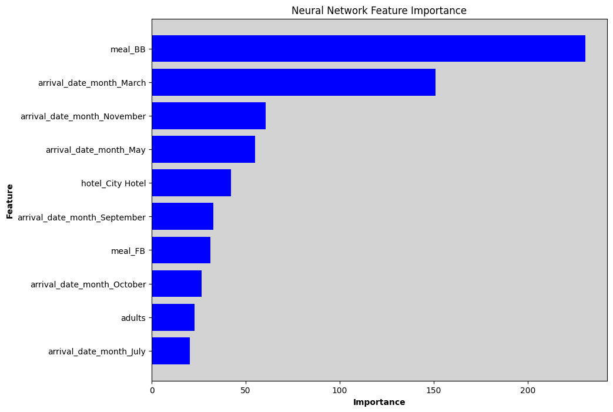

## Random Forest
In order to improve model performance, we tuned the hyperparameters of the RF model using the
GridSearchCV. These are the hyperparameters of the model after tuning: `criterion` = 'entropy', `max_depth` = 15, `n_estimators` = 300. The model has a moderately high AUC of 0.841 and identified the account of special requests as the most important variable in determining cancellation rates.

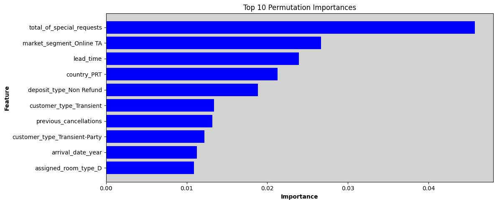

## XGBoost
As GridSearchCV took an exceptional amount of time, RandomisedSearchCV was used instead. After
tuning the model, we obtained the following hyperparameters from RandomSearchCV: `learning_rate` = 0.082, `max_depth` = 8, `n_estimators` = 483, with an AUC of 0.843.

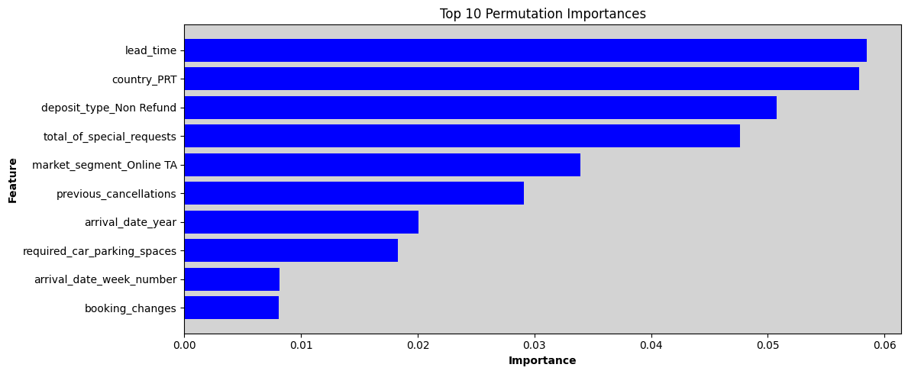

## Model Evaluation and Comparison
In predicting hotel cancellations, it is essential to consider both Type I and Type II errors. Type I errors involve inaccurately predicting cancellations, while Type II errors involve mistakenly anticipating non-cancellations. To account for the greater risk associated with Type II errors, we assigned a cost of **$50** to false positives and **$100** to false negatives. This decision stems from the significant revenue loss resulting from canceled bookings compared to the cost of following up on false positive cancellations. Our goal is to optimize Recall and AUC metrics to accurately identify cancellations.

Determining the optimal threshold involves finding the point of intersection between the AUC and Recall graph. Tuning this threshold is crucial as it impacts model predictions, business costs, and F1-score. Following threshold adjustments, we successfully reduced false positives across three models, with the exception of XGBoost. This outcome may be attributed to the complex hyperparameter tuning performed by RandomSearchCV, which could render the model susceptible to noise, outliers, and potential data leakage.

### Neural Network

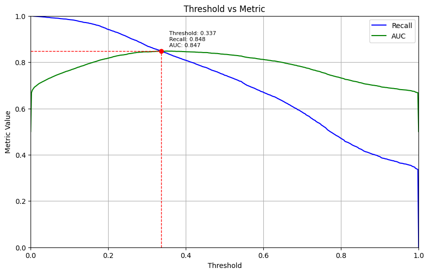

Threshold: 0.337

Recall: 0.848

AUC: 0.847

### Random Forest

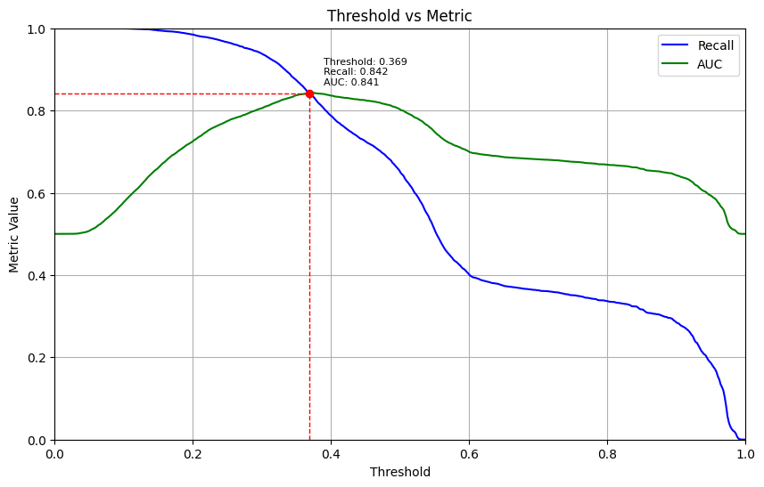

Threshold: 0.369

Recall: 0.842

AUC: 0.841

### XGBoost

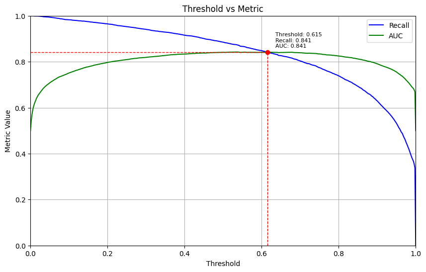

Threshold: 0.615

Recall: 0.841

AUC: 0.841

### Summary of False Negatives Pre and Post-Tuning

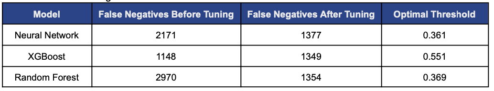

Following the adjustments to the threshold, we effectively decreased false positives across the models, with the exception of XGBoost. One potential explanation for this outcome might be attributed to the intricate hyperparameter tuning conducted by RandomizedSearchCV, resulting in susceptibility to noise, outliers, and potential data leakage. Additionally, it's plausible that the random nature of hyperparameter tuning may lead to the best set of hyperparameters after a specified number of iterations not being the optimal choice.

## Summary of All Metrics

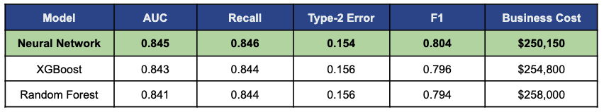

Models were evaluated based on the metricies above, with the final model selected for the highest AUC and Recall and lowest Business Cost. Thus, our chosen model is the Neural Network.

