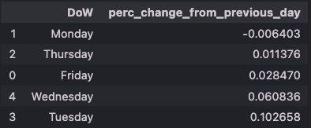

# Project Title
Analysis of VOO historical prices

***

# Project Overview
In this project, I seek to find out the best day to invest in a stock that I personally invest in, Vanguard 500 Index Fund ETF (VOO) data obtained from Yahoo Finance. 

***

# Installation and Setup
## Codes and Resources Used
Software Requirements and Editor used:
- **Editor Used:**  Visual Studio Code (VSCode)
- **Python Version:** 3.12.0

## Python Packages Used
- **Data Manipulation:** `pandas` and `numpy`

***

# Data 
## Source Data
The data obtained was from [Yahoo Finance](https://sg.finance.yahoo.com/quote/VOO?p=VOO&.tsrc=fin-srch) from the years 2010 to 2022.

***

# Results and Evaluation

Looking at the rates of returns, as a long term investor, Mondays would be best day to invest for me since I am not concerned with day-to-day changes in prices and prices seem to be lowest on Mondays. This also supports the Weekend Effect which is a phenomemon in which stock returns on Mondays are often significantly lower than those of the immediately preceding Friday.

