# Project Title
Wine Recommender System

***

# Project Overview
This project aims to build a Wine Recommender from scratch to simplify the process for beginners to embark on their journey of wine drinking. As they are various type of wines as well as their characteristics such as the types of food that the wine can pair with, body of the wine and Alcohol by Volume (ABV), among others. 

Refer to this guide: [A Short Guide to the 5 Basic Characteristics of Wine](https://club-vino.co.uk/a-short-guide-to-the-5-basic-characteristics-of-wine/)

Ensemble classification models such as Random Forest and XGBoost as a well as neural network such as Multi-Layer Perceptron were chosen to build the Recommender System. The models were trained, tested and validated and subsequently evaluated using a confusion matrix and classification report. Model performance using AUC as the scoring metric and chose the best performing model: Random Forest.

***

# Installation and Setup
## Codes and Resources Used
Software Requirements and Editor used:
- **Editor Used:**  Visual Studio Code (VSCode)
- **Python Version:** 3.12.0

## Python Packages Used
- **General Packages:** `re`
- **Data Manipulation:** `pandas` and `numpy`
- **Data Visualization:** `matplotlib` and `seaborn`
- **Machine Learning:** `scikit-learn`

***

# Data 
## Source Data
- **X-Wines:** The dataset was obtained from [X-Wines](https://www.mdpi.com/2504-2289/7/1/20)

## Description of Dataset
### Wines
| Column Name               | Column Type  |
|---------------------------|--------------|
| WineName                  | String       |
| Grapes                    | String List  |
| Harmonize                 | String List  |
| ABV                       | Float        |
| Body                      | String       |
| Acidity                   | String       |
| Country                   | String       |

### Wines Rating
| Column Name               | Column Type  |
|---------------------------|--------------|
| WineID                    | Integer      |
| Rating                    | Integer      |

## Data Cleaning/Preprocessing
- The dataset contained 100 000 records with no null records.

### Grapes
- Since Grapes is a `string list` column, a function was written to make this column a `string` type.
- Instead of giving the specific types of grapes used, the number of grapes used for each row of data is used instead. This is to aid beginners since it is likely that they do not know the specific name of the grapes used.

### Harmonize
- Just like Grapes, the column was converted into a `string` type
- Since each wine can be harmonized with many food, similar food were classified into major food types such as: Red meat, White meat, Cheese, Seafood, Italian, Dessert, Vegetarian, Snacks, Appetizer, and Others.(Refer to Source Code to see the exact classification of food)

### Body
- In the original data, the substring '-bodied' was removed.

### Type
- In the original data, there are various types of wine such as Red, White, Sparking, Dessert/Port and Dessert.
- Since Dessert/Port and Dessert are relatively similar, they were grouped together.

### Countries
- To ensure each country will be well-represented in the training and test data, only countries who has appeared more than 100 times was left in the dataset
 
### Final Dataset
- For catalogical variables such as Body, Country, Acidity and Harmonize were one-hot encoded before model training. 
- To simulate an actual winery with a finite number of wines available, after doing a random shuffle, the first 80 000 rows were used to train and test the model, while the remaining 20 000 was used for the wine catalogue.

## Data Exploration
### ABV by Wine Type

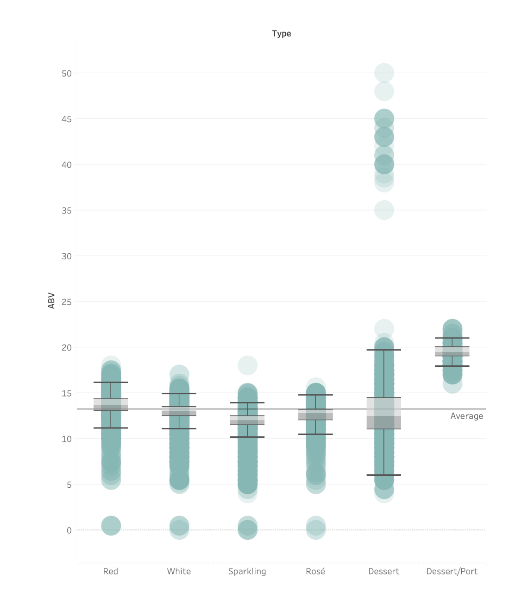

From the box plot above, we can see that:
- [Dessert/Port](https://usualwines.com/blogs/knowledge-base/dessert-wine) wines has the highest average alcohol content, which aligns with their reputation for having ABV levels typically running between 19% and 22%.
- The average ABV observed for table wines also corresponds with [industry norms](https://www.realsimple.com/holidays-entertaining/entertaining/food-drink/alcohol-content-wine), as these wines generally fall within the 5.5% to 20% ABV range.

### Wine Body and Acidity

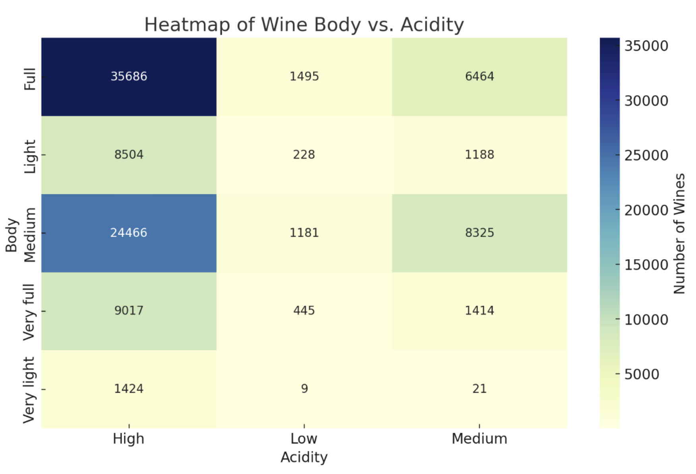

It is widely understood that wines with higher acidity tend to create a lighter sensation on the palate for the [drinker](https://www.wineinvestment.com/sg/learn/magazine/2019/05/understanding-the-five-basic-characteristics-of-wine/).

However, from the heatmap above, the dataset does not distinctly highlight this trend but it is not a cause of concern. There are many other factors intertwined with wine's body and acidity that collectively contribute to the overall tasting experience such as oak ageing, tannis and glycerol.

### Distribution of Wine Type Across Countries 

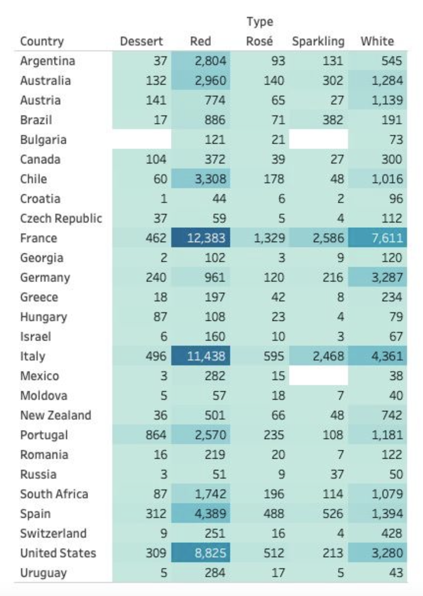

From the highlight table above, we can see that:
- France predominantly produces Red Wines, closely followed by Italy.
- Portugal tops the dataset for Dessert wines, nearly doubling the listings of France and Italy, which aligns with its fame for [Port wines](https://winefolly.com/deep-dive/what-is-port-wine/)

### Distribution of Wine Type

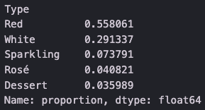

With the `Type` being our target variable, we can see that there is a imbalance data with Red wines being the most predominant wine type. Thus, in the model building process, [ensemble techniques](https://bmcmedinformdecismak.biomedcentral.com/articles/10.1186/s12911-022-01821-w#:~:text=Many%20studies%20have%20demonstrated%20that,and%20more%20comprehensive%20strong%20model.) would be used to counter the imbalance data.

***

# Results and Evaluation
## Model Performance
### Random Forest Classifier

Classification Report and Confusion Matrix:

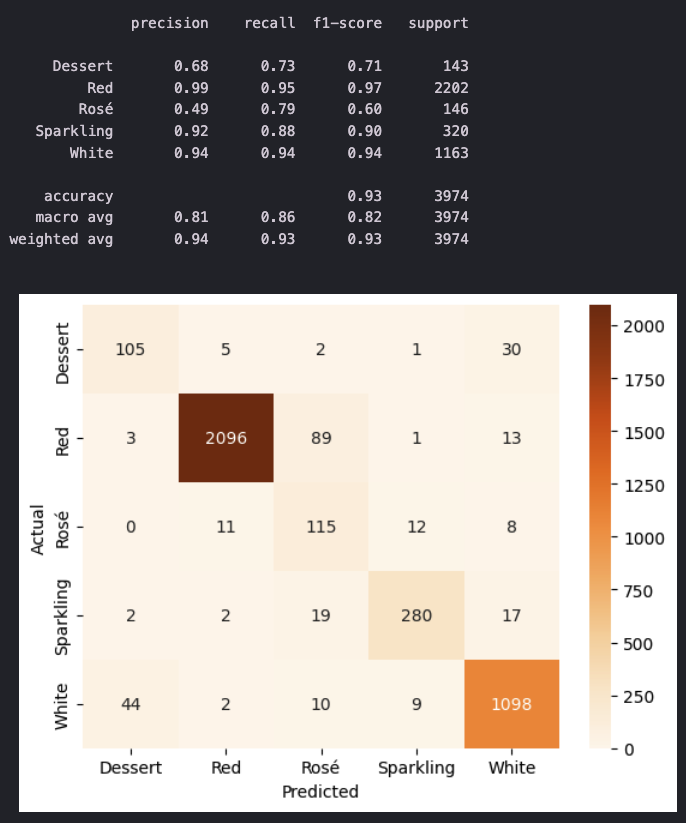

AUC before and after hyperparameter tuning:

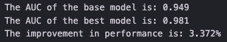

### Multi-Layer Perceptron Classifier

Classification Report and Confusion Matrix
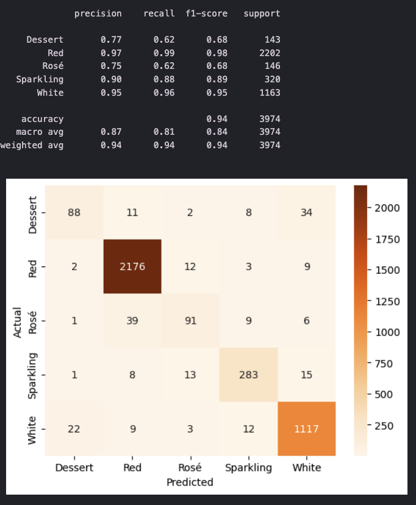

AUC before and after hyperparameter tuning:
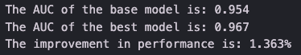

### XGBoost Classifier

Classification Report and Confusion Matrix:
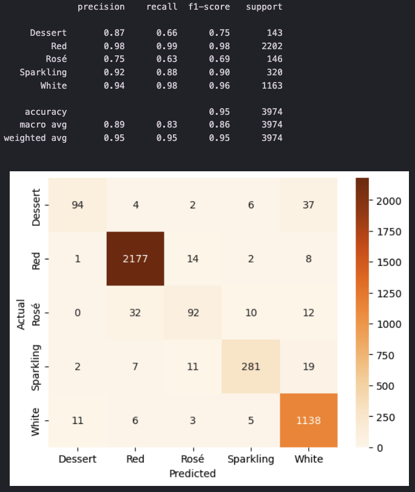

AUC before and after hyperparameter tuning:
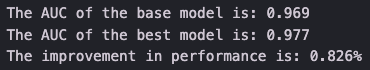

## Model Comparison
Comparing the improvements in AUC scores before and after tuning of the 3 models, we can see that Random Forest Classifier has the largest improvement in performance after tuning with 3.37%

Comparing the confusion matrix and the classification reports of the 3 models, we can see that:
- All 3 models performed very well in predicting wine types as shown by their F1 scores
- MLPClassifier was better in predicting Red, Rosé, and White wines than the Random Forest Classifier
- Random Forest Classifier was better in predicting Dessert and Sparkling wines than the MLPClassifier

## Model Interpretation (Feature Importance)
### Random Forest Classifier

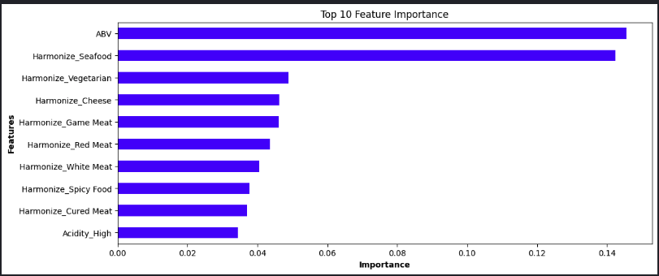

### Multi-Layer Perceptron Classifier

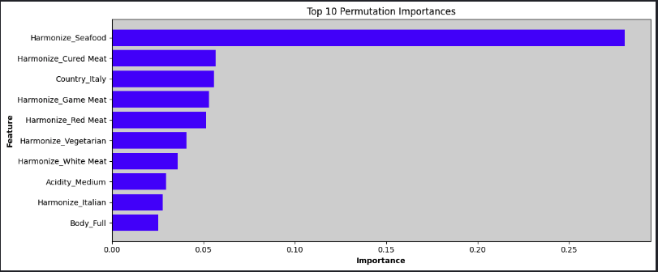

### XGBoost Classifier

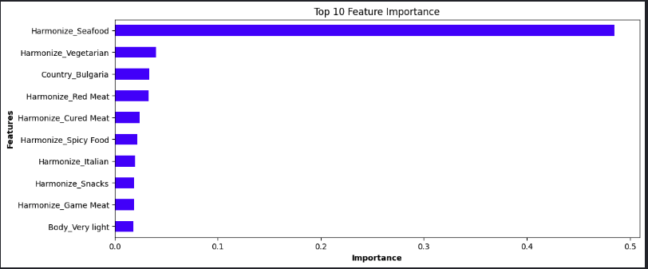

From the feature importances plot, we can see that:
- For all 3 models, we can see that whether the wine harmonises with seafood is very important (Harmonize_Seafood) and would have a huge implication on the type of wine recommended. 
- Random Forest seems to be the only model that places high importance on Alcohol by Volume (ABV).

## Model Comparison

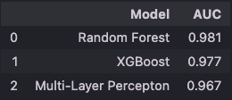

Using AUC as the evaluation metric, we decided to use the `Random Forest Classifier` model to predict wine types for users since it performed the best.

***

# Recommendation Function
## Summary
In the `Recommender Function.ipynb` notebook, it contains the recommender function built to suggest a wine type tailored to users' preferences. The top 3 most highly rated wines of that type from the country given in the inputs will be recommended to them.
- If there are no such options availiable, the top 3 most highly rated wines across the whole catalogue will be given to the user. 
- If the country, given by the user, does not have at least 3 wines of the predicted type, the remaining will be filled by the other top rated wines of that type from the catalogue that the user can try.

***

# Benefits to Key Stakeholders
## Restaurants
Restaurants can utilize this system to boost revenue and provide personalized recommendations to customers. It can also enhance inventory management by predicting demand for different wine types and identifying common trends. This can help expand wine selection, sourcing a wider range of wines from different countries that complement their dishes.

## Individuals
The recommender system enhances restaurant patrons' wine experience by matching their preferences with food pairings, enhancing dining satisfaction. It also helps those lacking wine knowledge learn to appreciate wine.

***

# Limitations
- Price was not taken into account
- Average ratings for each wine was used in the recommender function. For wines who are not reviewed as many times as others, results may be skewed. Using median instead of mean might help with this issue.

