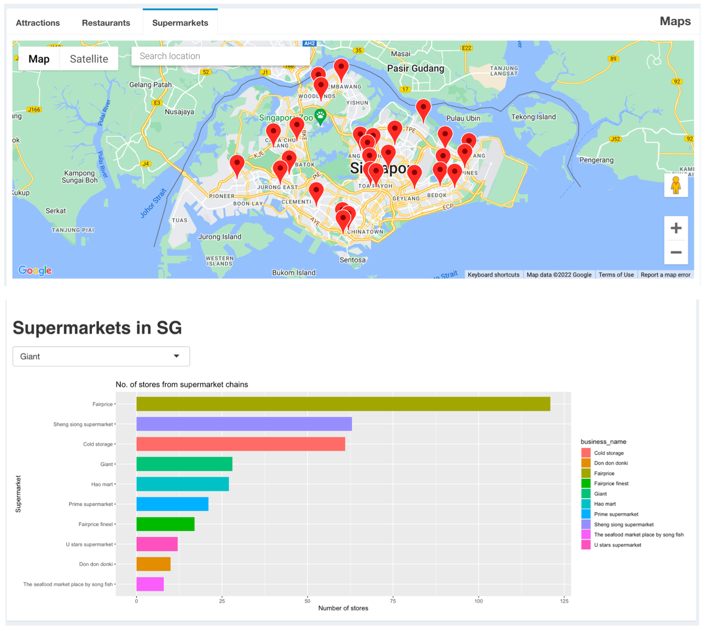
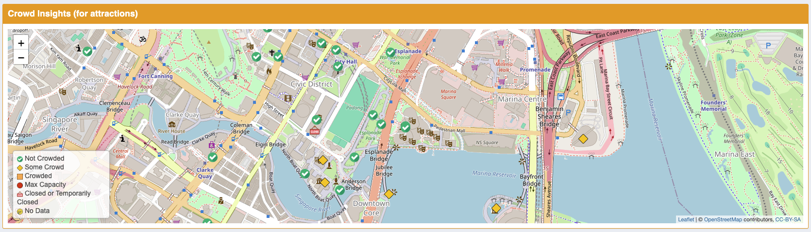

# Project Title
GoWhereSia: All-in-one Travel App

***

# Project Overview
This project aims to build an [All-in-One travel app](https://tinyurl.com/GoWhereSia) using RShiny for tourists to browse through while planning for their day in Singapore. All the information such as weather forecast, crowds insight and information about each attraction should be available at their fingertips.

***

# Installation and Setup
## Codes and Resources Used
Software Requirements and Editor used:
- **Editor Used:**  RStudio
- **R Version:** RStudio-2021.09.1-372

## R Packages Used
- **Data Manipulation and Analysis:** `dplyr`, `tidyr`, `compareGroups`, `rvest`, `XML`, `stringr`, `readr`, `RSelenium`
- **Data Visualisation:** `ggplot2`, `ggmap`, `ggimage`, `leaflet`, `wordcloud`, `wordcloud2`, `RColorBrewer`, `ggplot2`
- **Web Development and Interactivity:** `shiny`, `shinyWidgets`, `shinyjs`, `shinydashboard`, `shinydashboardPlus`, `shinyTime`, `shinyEffects`, `leaflet.extras`, `googleway`
- **Text Processing:** `stringr`, `rvest`, `XML`, `jsonlite`, `tidyr`, `readr`
- **Miscellaneous:** `magrittr` and `htmlwidgets`

***

# Data 
## Source Data
- **Attractions:** Referenced popular tourist attractions on [TripAdvisor](https://www.tripadvisor.com/Attractions-g294265-Activities-Singapore.html) and attractions listed on [government's database](https://beta.data.gov.sg/datasets/d_0f2f47515425404e6c9d2a040dd87354/view). Combined datasets with crowd insight from the Google Insights Popular Times page.
- **Restaurants:** Scraped data from [Chope](https://www.chope.co/singapore-restaurants/list_of_restaurants?source=chope.com.sg&lang=en_US) to extract a list of over a thousand restaurants in Singapore.
- **Supermarkets and Hawker Centers:** Obtained under Singapore open data license from Data Singapore for the list of [supermarkets](https://beta.data.gov.sg/datasets/d_11edd0117280c5776651d7891114c88c/view) and [hawkers centers](https://beta.data.gov.sg/datasets/d_68a42f09f350881996d83f9cd73ab02f/view) in Singapore.
- **Weather:** Obtain from live weather[API](https://beta.data.gov.sg/datasets?query=weather%20forecast).

# App Features
## Home Tab
- Includes features such as **Explore More**, **COVID-19 Travel Updates**, **Promotions and Advertisement**.

### "Explore More"
- Displays 6 main features of GWS, allowing users to quickly navigate to their desired tabs with ease (refer to image below)

### COVID-19 Travel Updates
- Displays the latest travel regulations and accepted vaccines from the Singapore government.

### Promotions and Advertisements
- Allows for collaboration between GoWhereSia (GWS) and other companies to earn revenue.
- By featuring advertisements for local attractions or restaurants, or offering discounts exclusive to GWS, users can enjoy discounted prices for their attraction tickets.

## Quick Search Tab
- Includes features such as filters for attractions, restaurants (including hawker centers) and supermarkets.

Map with attractions based on price filter:

Map with supermarkets in Singapore:

## Itinerary Tab
### Personalised Itinerary Planning
- Allows users to filter and choose the price range and whether they prefer indoor or outdoor activities

### Smart Recommendations
- Recommends activities based on latest weather forecast

### Top Attractions in Singapore
- Displays the top 20 most popular attractions in Singapore

## Crowd Insights Tab
- Features a map that indicates the crowd level for each of the locations.

## Weather Tab
- Features weather forecast and UV index.
- Weather forecast data is linked to the database under National Environment Agency of Singapore. 

## News Tab
- Features articles about fun activities, attractions and restaurants to visit in Singapore.

# Limitations
- Inability to book tickets to attractions on the website.
- Singaporeans may not enticed to use the app as they may not be interested in conventional tourist attractions.

# Collaborators
- Faith Tham
- Li Yi 
- May Zhu
- Hong Yao

